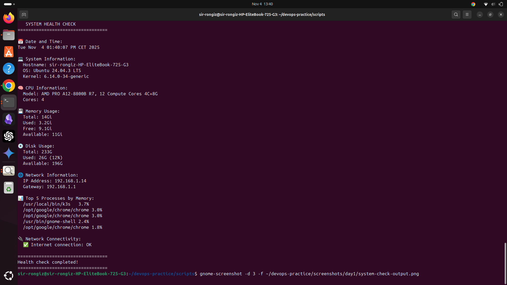
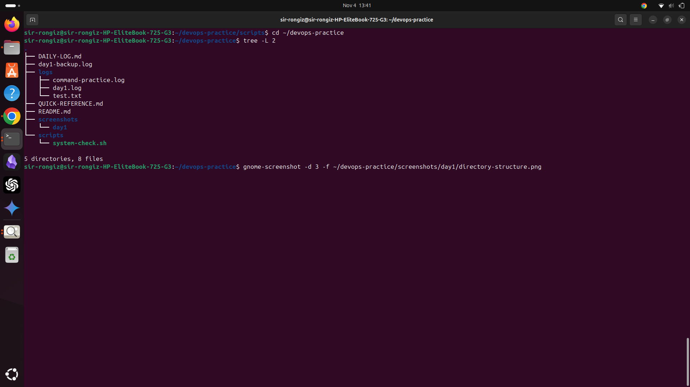
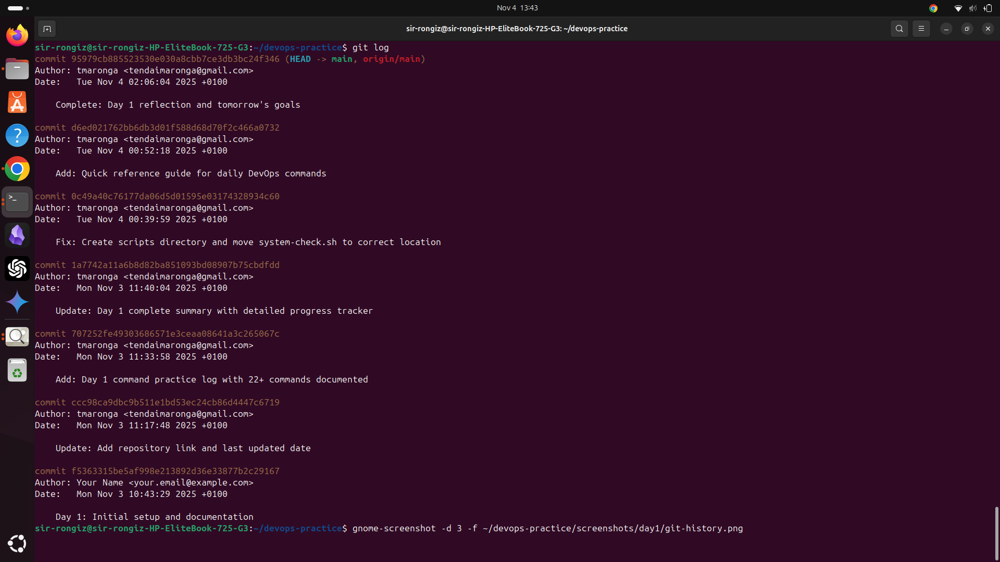
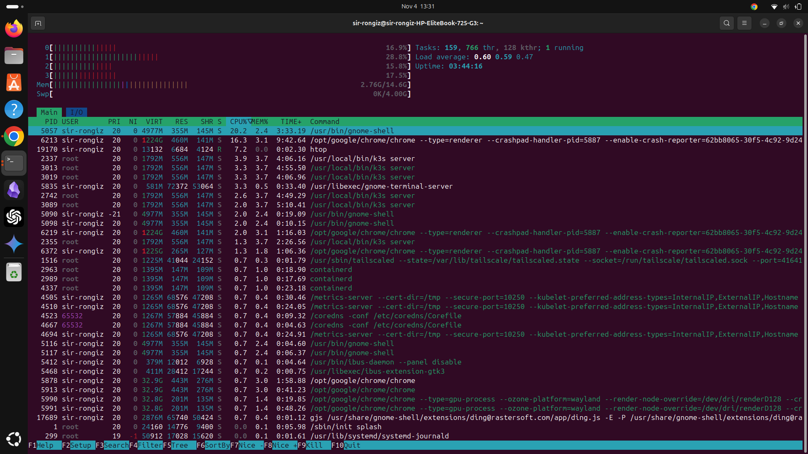

# Day 1 Screenshots - November 4, 2025

## System Health Check

**Description:** Output from my first automation script - `system-check.sh`  
**Shows:** CPU, memory, disk usage, network connectivity, top processes

---

## Directory Structure

**Description:** Organized workspace for 12-week DevOps learning journey  
**Shows:** Clean folder structure with scripts, logs, configs, and documentation

---

## Git Commit History

**Description:** My first commits to the DevOps homelab repository  
**Shows:** Version control workflow and commit messages

---

## System Resources

**Description:** HP EliteBook 725 G3 running Ubuntu 24.04  
**Specs:**
- CPU: AMD PRO A12-8800B (4 cores)
- RAM: 14GB
- Storage: 233GB (196GB available)
- Currently running K3s and Chrome

---

**Date:** November 4, 2025  
**Milestone:** Day 1 Complete  
**Focus:** Linux basics, Git workflow, Shell scripting  
**Repository:** https://github.com/tmaronga/DevOPs-Homelab
