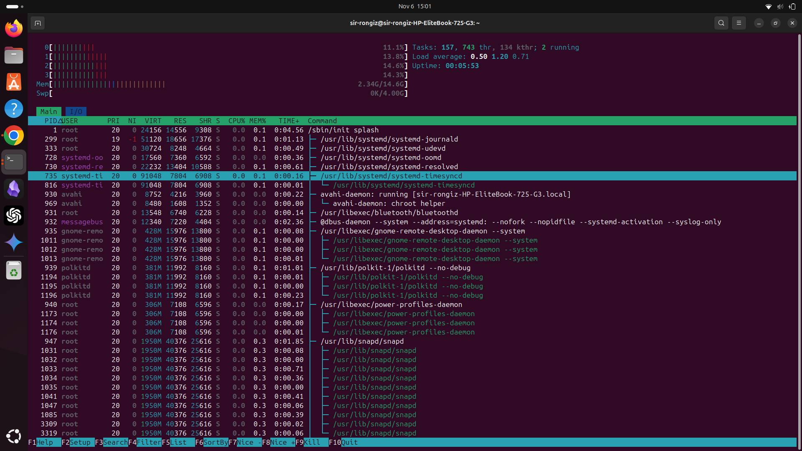
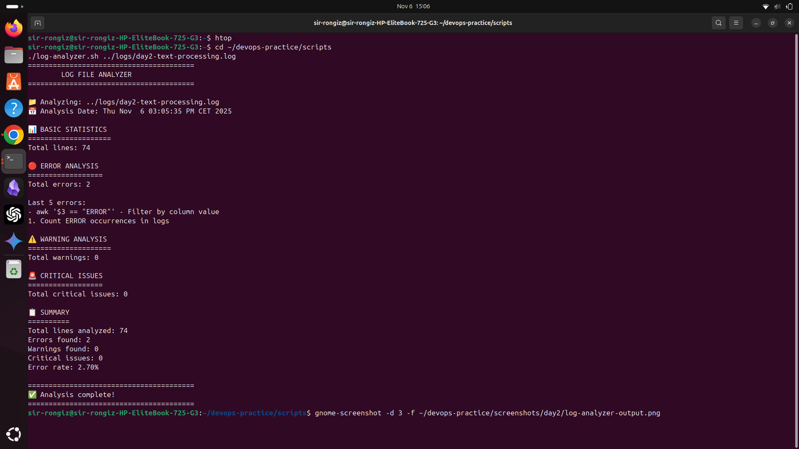
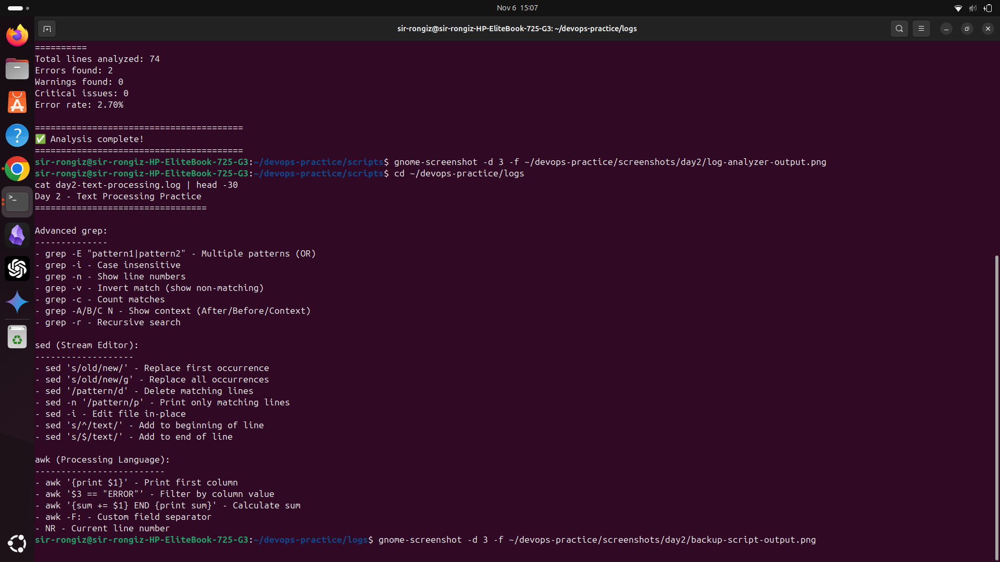
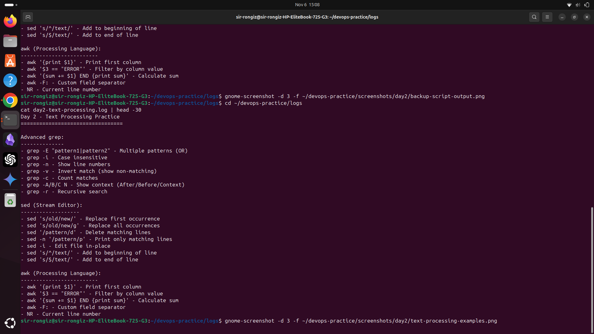
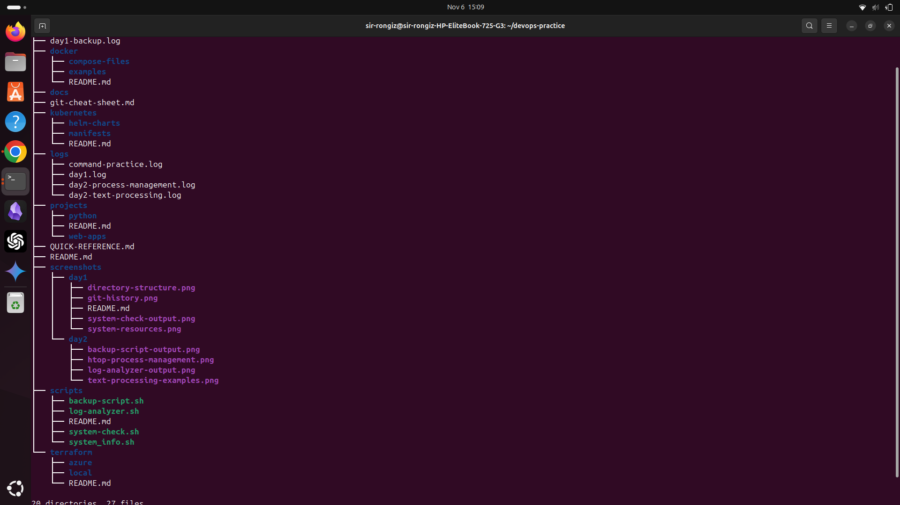

# Day 2 Screenshots - November 5-6, 2025

## Process Management with htop

**Description:** Interactive process monitoring showing CPU, memory, and running processes  
**Skills:** ps, top, htop, kill, systemctl

---

## Log Analyzer Script

**Description:** Custom script analyzing log files for errors, warnings, and critical issues  
**Features:** 
- Error counting and reporting
- Warning detection
- Critical issue highlighting
- Statistics and percentages

---

## Backup Script

**Description:** Automated backup script with timestamps  
**Features:**
- Timestamped backups
- Size calculation
- Progress reporting
- Backup history

---

## Text Processing Examples

**Description:** Advanced text processing with grep, sed, and awk  
**Skills:**
- Pattern matching with grep
- Stream editing with sed
- Data extraction with awk
- Command piping

---

## Complete Directory Structure

**Description:** Organized workspace with scripts, logs, and documentation  
**Shows:** Clean folder hierarchy ready for Docker (Week 2)

---

**Date:** November 5-6, 2025  
**Milestone:** Day 2 Complete  
**Focus:** Process management, Text processing, Automation scripts  
**New Skills:** htop, grep, sed, awk, pipes, systemctl  
**Scripts Created:** 2 (log-analyzer.sh, backup-script.sh)  
**Repository:** https://github.com/tmaronga/DevOPs-Homelab
